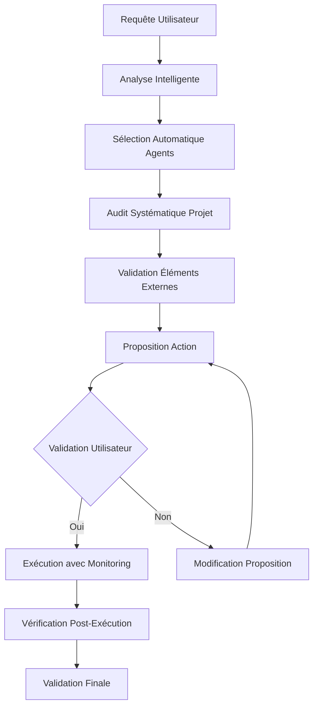

# Sélection Intelligente d'Agents et Audit Systématique

## Principes Fondamentaux

### 1. Sélection Autonome et Intelligente des Agents

#### Analyse Automatique de la Complexité
```python
# Algorithme d'évaluation de complexité sans mots-clés
def analyser_complexite_tache(tache_description, contexte_projet):
    """
    Évalue la complexité d'une tâche basée sur:
    - Nombre de systèmes impliqués (Flutter, Supabase, etc.)
    - Profondeur des modifications requises
    - Interdépendances identifiées
    - Risques potentiels
    """
    complexite = {
        "niveau": "simple",  # simple, moyenne, complexe, critique
        "systemes_concernes": [],
        "agents_requis": [],
        "risques": [],
        "audit_prealable": []
    }
    
    # Analyse sémantique de la description
    # Analyse du contexte projet existant
    # Identification des dépendances
    
    return complexite
```

#### Matrice de Sélection d'Agents
| Type de Tâche | Agent Principal | Agents Secondaires | Critères de Sélection |
|---------------|----------------|-------------------|----------------------|
| **UI/Flutter** | flutter_ui_agent | flutter_state_agent | Modifications layout, widgets, thèmes |
| **Backend/Supabase** | supabase_db_agent | supabase_auth_agent | Tables, fonctions, authentification |
| **Connexion** | integration_agent | flutter_agent + supabase_agent | API, appels réseau, synchronisation |
| **Architecture** | system_architect | tous les agents spécialisés | Structure globale, patterns |
| **Débogage** | debug_agent | agent_spécifique_au_domaine | Erreurs, performances, logs |

#### Processus de Sélection Automatique
1. **Analyse contextuelle** de la demande
2. **Identification des entités** (Flutter, Supabase, autres)
3. **Évaluation de l'impact** sur chaque système
4. **Sélection multi-agents** si nécessaire
5. **Hiérarchisation** des responsabilités

### 2. Audit Systématique Avant Exécution

#### Audit Flutter
```yaml
audit_flutter:
  structure:
    - vérifier_arborescence_dossiers()
    - analyser_fichiers_pubspec.yaml()
    - valider_dependencies()
  code:
    - scanner_imports_supabase()
    - analyser_etat_global()
    - vérifier_configuration_routes()
  composants:
    - identifier_widgets_impactes()
    - valider_etat_manageurs()
    - vérifier_services_externes()
```

#### Audit Supabase
```yaml
audit_supabase:
  base_de_donnees:
    - lister_tables_existantes()
    - vérifier_schémas_columns()
    - valider_contraintes_foreign_keys()
  fonctions:
    - scanner_fonctions_rpc()
    - vérifier_triggers_existants()
    - valider_policies_rls()
  authentification:
    - vérifier_schemas_auth()
    - valider_providers_configures()
    - analyser_policies_acces()
```

#### Audit de Connexion
```yaml
audit_integration:
  api:
    - vérifier_endpoints_flutter()
    - valider_correspondance_supabase()
    - tester_formats_donnees()
  securite:
    - vérifier_cle_api()
    - valider_tokens_auth()
    - contrôler_cors_policies()
```

### 3. Validation Stricte des Éléments Externes

#### Processus de Vérification
1. **Existence des éléments** (tables, fonctions, widgets)
2. **Correspondance des types** (données, paramètres)
3. **Compatibilité des versions** (SDK, packages)
4. **Cohérence des interfaces** (signatures, retours)

#### Matrice de Validation
| Élément | Vérification Flutter | Vérification Supabase | Validation Croisée |
|---------|---------------------|----------------------|-------------------|
| **Table** | Modèle correspondant | Schéma existe | Types compatibles |
| **Fonction** | Appel RPC défini | Fonction RPC existe | Paramètres valides |
| **Auth** | Provider configuré | Schema auth exists | Flow compatible |
| **Storage** | URL configurée | Bucket exists | Permissions OK |

### 4. Processus d'Audit et Validation

#### Workflow d'Exécution


#### Audit Pré-Exécution Obligatoire
1. **Scanner la structure** complète du projet
2. **Identifier les dépendances** actives
3. **Vérifier l'état** des systèmes concernés
4. **Analyser l'impact** potentiel
5. **Documenter les risques** identifiés

### 5. Règles de Validation et Communication

#### Format de Proposition d'Action
```markdown
## 📋 Analyse et Proposition d'Action

### 🔍 Audit Effectué
- **Flutter**: X fichiers analysés, Y composants identifiés
- **Supabase**: X tables vérifiées, Y fonctions validées
- **Connexion**: X endpoints testés, Y auth flows vérifiés

### 🎯 Action Proposée
- **Description**: Modification/ajout proposé
- **Impact**: Fichiers/fonctions concernés
- **Risques**: Potentiels problèmes identifiés
- **Bénéfices**: Améliorations attendues

### ✅ Validation Requise
- **Confirmation**: L'action est-elle correcte ?
- **Modifications**: Changements nécessaires ?
- **Risques acceptés**: Les risques sont-ils acceptables ?
```

#### Processus de Validation
1. **Audit complet** effectué et documenté
2. **Proposition claire** avec impacts identifiés
3. **Risques explicites** et stratégies de mitigation
4. **Validation explicite** requise avant exécution
5. **Monitoring continu** pendant l'exécution

### 6. Règle Anti-Déduction

#### Principe de Vérification Systématique
- **Jamais supposer** l'existence d'un élément
- **Toujours vérifier** physiquement l'existence
- **Documenter précisément** ce qui existe/n'existe pas
- **Ne jamais extrapoler** à partir d'éléments similaires

#### Checklist de Vérification
```yaml
verification_element:
  existence:
    - scanner_fichiers_projet()
    - interroger_base_donnees()
    - valider_api_endpoints()
  coherence:
    - comparer_types_donnees()
    - valider_signatures_fonctions()
    - vérifier_formats_reponses()
  documentation:
    - lister_elements_trouves()
    - documenter_elements_manquants()
    - noter_incoherences_detectees()
```

## Implémentation Technique

### Agents Spécialisés

#### flutter_ui_agent
- Responsable: Interface utilisateur, widgets, layout
- Audit: Structure UI, états, animations
- Validation: Compatibilité thème, responsive design

#### supabase_db_agent
- Responsable: Base de données, schémas, migrations
- Audit: Tables, colonnes, contraintes, indexes
- Validation: Cohérence des modèles, relations

#### integration_agent
- Responsable: Connexions Flutter-Supabase
- Audit: API clients, auth flows, gestion d'erreurs
- Validation: Sécurité, performance, fiabilité

#### system_architect_agent
- Responsable: Architecture globale, patterns
- Audit: Structure projet, dépendances, scalabilité
- Validation: Cohérence architecture, best practices

### Métriques d'Évaluation

#### Complexité de Tâche
- **Simple**: Modification d'un seul fichier, une seule technologie
- **Moyenne**: Plusieurs fichiers, une technologie principale
- **Complexe**: Multi-technologies, modifications structurelles
- **Critique**: Architecture, base de données, systèmes critiques

#### Risque Potentiel
- **Faible**: Modifications cosmétiques, ajout de fonctionnalités
- **Moyen**: Modifications logiques, changements d'API
- **Élevé**: Structure de données, authentification, performances
- **Critique**: Migration de données, changements d'architecture

## Exemples Concrets

### Scénario 1: Ajout d'un nouveau champ utilisateur
1. **Analyse**: Demande implique UI + BDD + API
2. **Sélection**: flutter_ui_agent + supabase_db_agent + integration_agent
3. **Audit**: Vérifier table users, modèle User, formulaire d'inscription
4. **Validation**: Confirmer existence colonne email dans users
5. **Proposition**: Ajouter champ phone avec migration et mise à jour UI
6. **Exécution**: Après validation utilisateur

### Scénario 2: Optimisation de requêtes
1. **Analyse**: Performance Supabase + Flutter
2. **Sélection**: supabase_db_agent + integration_agent
3. **Audit**: Analyser requêtes existantes, indexes, temps de réponse
4. **Validation**: Vérifier tables impactées, indexes existants
5. **Proposition**: Ajouter indexes, optimiser requêtes spécifiques
6. **Exécution**: Monitoring performance avant/après

Cette approche garantit une sélection intelligente des agents et un audit rigoureux avant toute modification, éliminant les suppositions et assurant la cohérence du système.
